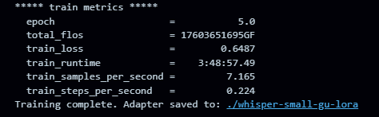
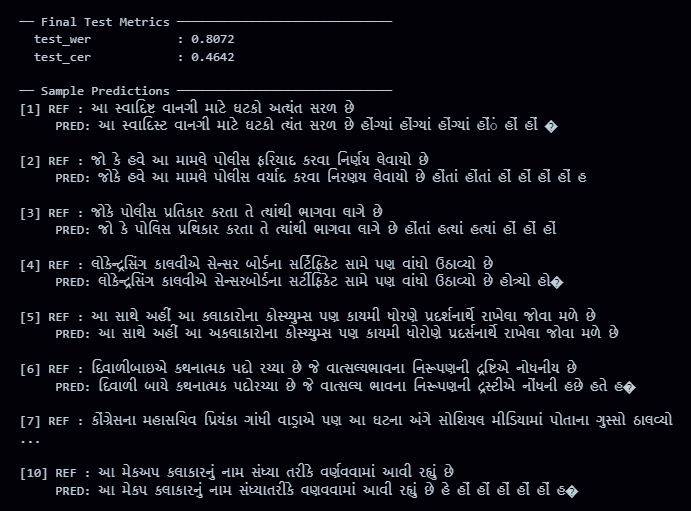
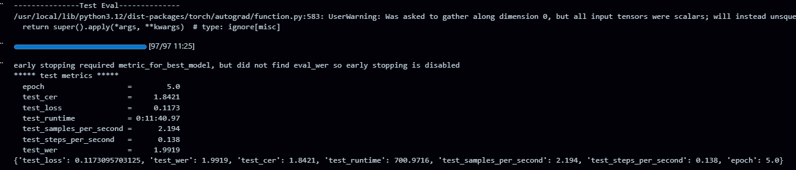
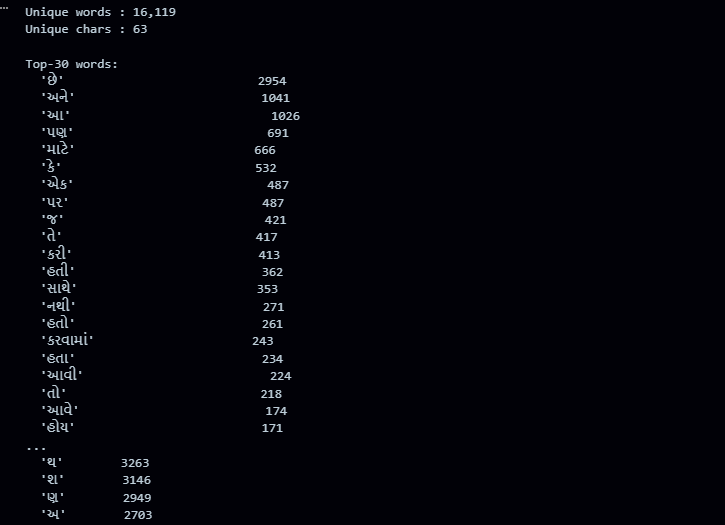
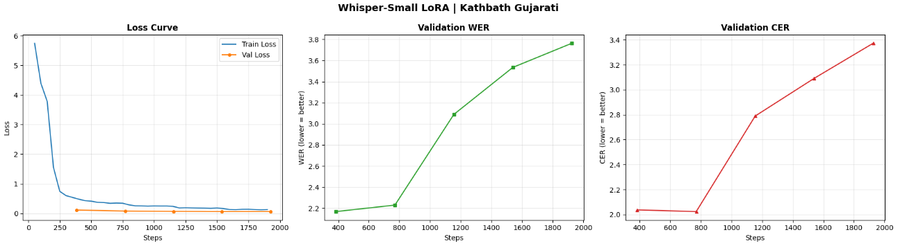
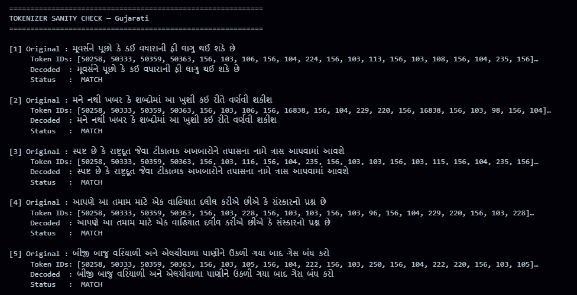

# Whisper-Small LoRA Fine-tuning on Kathbath Gujarati

Fine-tuned OpenAI's Whisper-Small on the AI4Bharat Kathbath Gujarati ASR dataset using LoRA (Low-Rank Adaptation). Targets Kaggle 2x T4 GPUs with fp16 training.

---

## Model

| Property | Value |
|----------|-------|
| Base model | `openai/whisper-small` |
| Method | LoRA (PEFT) |
| Language | Gujarati (`gu`) |
| Task | Transcription |
| Dataset | `ai4bharat/kathbath` |
| Precision | fp16 |
| Target hardware | Kaggle 2x T4 (15 GiB each) |

---

## LoRA Config

| Param | Value |
|-------|-------|
| `r` | 32 |
| `lora_alpha` | 64 |
| `dropout` | 0.05 |
| `bias` | none |
| Target modules | `q_proj`, `v_proj`, `k_proj`, `out_proj`, `fc1`, `fc2` |

---

## Train Metrics 


## Test Metrics 







## Test - eval 




## word freq 





## Loss Curves 





## Tokenizer check 





---


## Pipeline Overview

```
1. Load tokenizer, feature extractor, processor  (Whisper-Small)
2. Load dataset                                   (ai4bharat/kathbath, gu)
3. Split                                          (train[:23%] / valid / test)
4. Vocabulary analysis                            (word + char frequency plots)
5. Audio preprocessing                            (resample → 16kHz, truncate/pad, log-mel)
6. Tokenizer sanity check                         (5 random samples encode→decode)
7. Apply LoRA to Whisper-Small
8. Train with Seq2SeqTrainer                      (fp16, cosine LR, early stopping)
9. Plot training curves                           (loss, WER, CER)
10. Visualize spectrograms
11. Evaluate on test set                          (WER, CER)
12. Save merged model + PyTorch checkpoint
13. Download model                                (4 format options)
14. Log everything to W&B
```

---

### HuggingFace Access

The Kathbath dataset is gated. You need to:

1. Create an account at https://huggingface.co
2. Request access at https://huggingface.co/datasets/ai4bharat/kathbath
3. Generate a token at https://huggingface.co/settings/tokens
4. On Kaggle, store the token as a secret named `HF_TOKEN_3` and load it:

```python
from kaggle_secrets import UserSecretsClient
from huggingface_hub import login

hf_token = UserSecretsClient().get_secret("HF_TOKEN_3")
login(token=hf_token)
```

### W&B

```python
import wandb
wandb.login()  # paste API key from https://wandb.ai/authorize
```

---

## Hyperparameters

All hyperparameters are in the `HParams` dataclass at the top of the notebook. Key ones:

```python
lora_r              = 32
lora_alpha          = 64
learning_rate       = 1e-4
num_train_epochs    = 8
per_device_train_bs = 8
gradient_accumulation = 2
warmup_steps        = 300
early_stopping_patience = 4
```

---

## Metrics

| Metric | Description |
|--------|-------------|
| WER | Word Error Rate (primary, lower is better) |
| CER | Character Error Rate (lower is better) |

---

## Saved Outputs

| Path | Contents |
|------|----------|
| `./whisper-small-gu-lora/` | LoRA adapter weights |
| `./whisper-small-gu-lora/best_merged/` | Merged HF model (safetensors) |
| `./whisper-small-gu-lora/best_merged/checkpoint.pt` | Raw PyTorch state dict |
| `./whisper-small-gu-onnx/` | ONNX model for edge deployment |

---


## Author

Rudra — [github.com/dev-tr26](https://github.com/dev-tr26) | [huggingface.co/rtxtd](https://huggingface.co/rtxtd)
